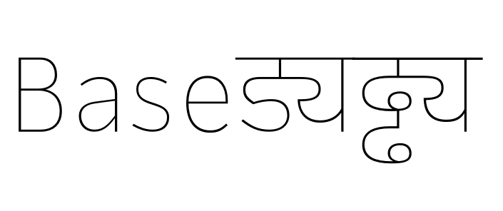
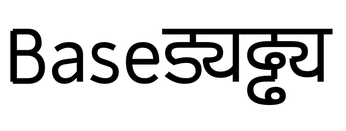
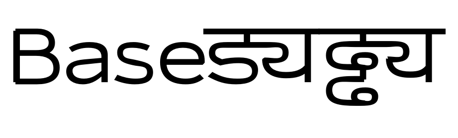
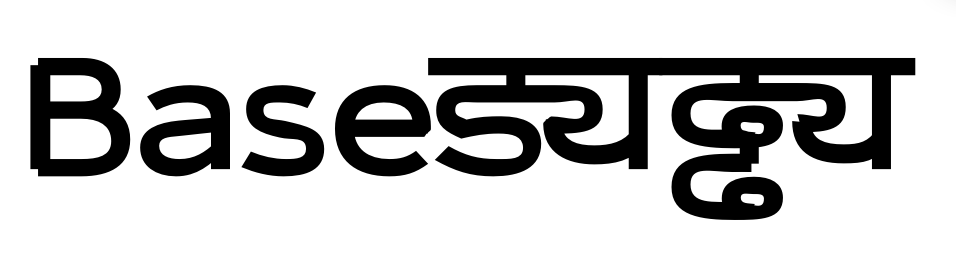
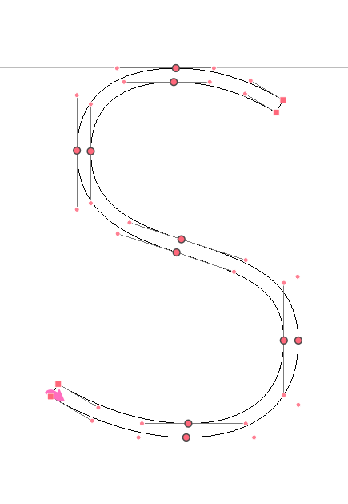
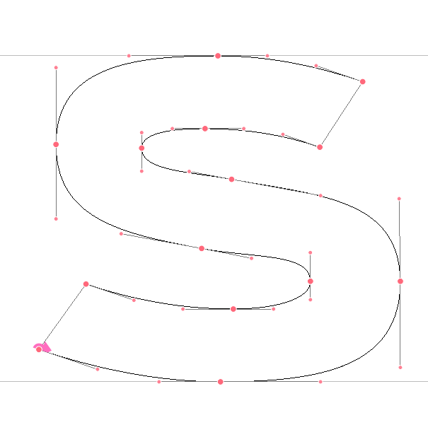
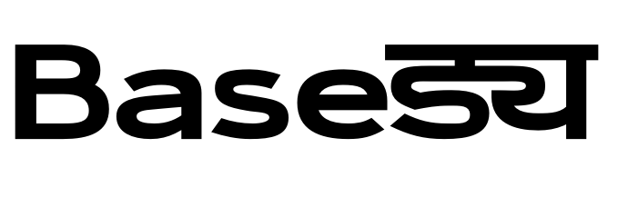

## Setting up *Black Wide* in cps

As Sean Sans original drawing is a *Hairline* already I want to test the *Black Wide* from the other side of the [design space setup](http://metapolator.github.io/sean/). Taking Lasses Demo Project I duplicate inherited.cps from data/com.metapolator/cps folder into blackwide.cps and add it to the project setup (project.yaml)

	
	masters:
	  base:
	    cpsChain:
	      - lib/centreline-skeleton-to-symmetric-outline.cps
	      - base.cps
	    skeleton: skeleton.base
	  enhanced:
	    cpsChain:
	      - lib/centreline-skeleton-to-symmetric-outline.cps
	      - base.cps
	      - lib/point-child-base.cps
	      - lib/weight.cps
	      - lib/scale.cps
	      - enhanced.cps
	    skeleton: skeleton.base
	  inherited:
	    cpsChain:
	      - lib/centreline-skeleton-to-symmetric-outline.cps
	      - lib/point-child-base.cps
	      - lib/single-inheritance.cps
	      - lib/weight.cps
	      - lib/scale.cps
	      - inherited.cps
	    skeleton: skeleton.base
	  blackwide:
	    cpsChain:
	      - lib/centreline-skeleton-to-symmetric-outline.cps
	      - lib/point-child-base.cps
	      - lib/single-inheritance.cps
	      - lib/weight.cps
	      - lib/scale.cps
	      - blackwide.cps
	    skeleton: skeleton.base    
	  interpolated:
	    cpsChain:
	      - lib/interpolate-2.cps
	      - interpolated.cps
	    skeleton: skeleton.base
	  metapolated:
	    cpsChain:
	      - lib/centreline-skeleton-to-symmetric-outline.cps
	      - lib/metapolate-2.cps
	      - metapolated.cps
	    skeleton: skeleton.base

To see how far I can scale the stroke vertically, I look at B, a, s, e, uni0921094D092F and uni0922094D0922094D092F

In blackwide.cps to scale the `penStroke` I set `weighFactor` to `4`:

    point > left, point > right {
        weightFactor: 4;
    }

This should result in a stroke four times scaled the original.

NOTE: I'm keeping the file /glyphs.skeleton.base/contents.plist open and list only the glyphs I want to test:

	<?xml version="1.0" encoding="UTF-8"?>
	<!DOCTYPE plist PUBLIC "-//Apple//DTD PLIST 1.0//EN" "http://www.apple.com/DTDs/PropertyList-1.0.dtd"><plist version="1.0"><dict>
	
	<key>B</key><string>B_.glif</string>
	<key>a</key><string>a.glif</string>
	<key>s</key><string>s.glif</string>
	<key>e</key><string>e.glif</string>
	<key>uni0921094D092F</key><string>uni0921094D_092F_.glif</string>
	<key>uni0922094D0922094D092F</key><string>uni0922094D_0922094D_092F_.glif</string>
	
	</dict></plist>

And run 

	metapolator export blackwide blackwide.ufo	
	

Before increasing the weight, I change the width by scaling the original width by 1.4:

    point > center {
        widthFactor: 1.4;
        skeleton: base;
    }
    
  

and try `weightFactor 6`!

  

Now we need to compensate a few things. As we can see on this s, I set the original strokes exactly inbetween baseline and glyph height. So I need to scale the verticals back to the glyph heights as the stroke "grows" from its center:
  

NOTE: overshoot will be added in a 2nd process.
By knowing the horizontal base strokes (which measures 20units) I can scale back the height of the 's' by dividing the stroke-height-ratio and the stroke-height-ration multiplied with the weight factor:

`ratio = 1*(1-(stroke/height*factor))/(1-stroke/height)`

	@namespace(glyph#s) {	
	point > center {
	    on: (Scaling widthFactor 1 * (1* (1-(stroke / Lx * factor)) / (1- stroke / Lx))) * parent:skeleton:on + Vector 0 shifts;
	    in: (Scaling widthFactor 1 * (1* (1-(stroke / Lx * factor)) / (1- stroke / Lx))) *  parent:skeleton:in + Vector 0 shifts;
	    out: (Scaling widthFactor 1 * (1* (1-(stroke / Lx * factor)) / (1- stroke / Lx))) * parent:skeleton:out + Vector 0 shifts;
	}

the variables we can store in a `@dictionary`

	@dictionary {
	    center {
	        factor: 4.5; 
	        Lx: 533;
	        halfstroke: 10;
	        stroke: halfstroke + halfstroke;
	        Lxs: Lx - stroke;
	        shiftfactor: factor - 1; 
	        shifts: Lx / Lxs * shiftfactor * halfstroke;
	    } 
	}
	

The inner curves I can fix with *inTension* and *outTension* 

	point:i(2) > left{
	    inTension: extraTension * base:inTension;
	    outTension: extraTension * base:outTension;
	}

So far so good for the s, now lets have a look what happened to the other glyphs:

What happened to those open corners? Read on [Strokes vs Knots]()

