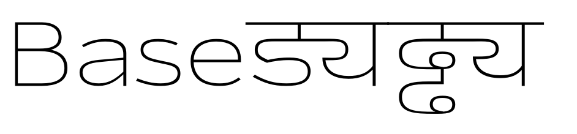
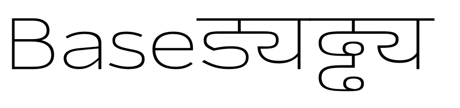
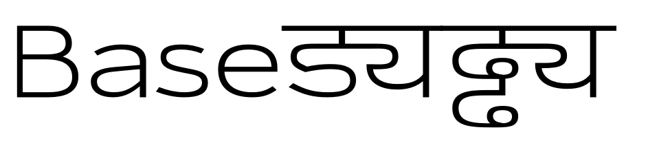

## Interpolating *Thin Wide* and *Black Wide*

I'm using Pablo Impallari's [weight stepping](http://www.impallari.com/familysteps/index.php) to calculate the proportion for each weight. In `interpolated.cps` I set:

	@dictionary {
	    * {
	        baseMaster1: S"master#thinwide";
	        baseMaster2: S"master#blackwide";
	        proportion1: 100;
	        proportion2: 10;
	    }
	}

`10` 

`14` 

`21` 

`31` 

`43` 

`57` 

`72`  

`87` 

`100` 

[back home](https://github.com/metapolator/sean)
