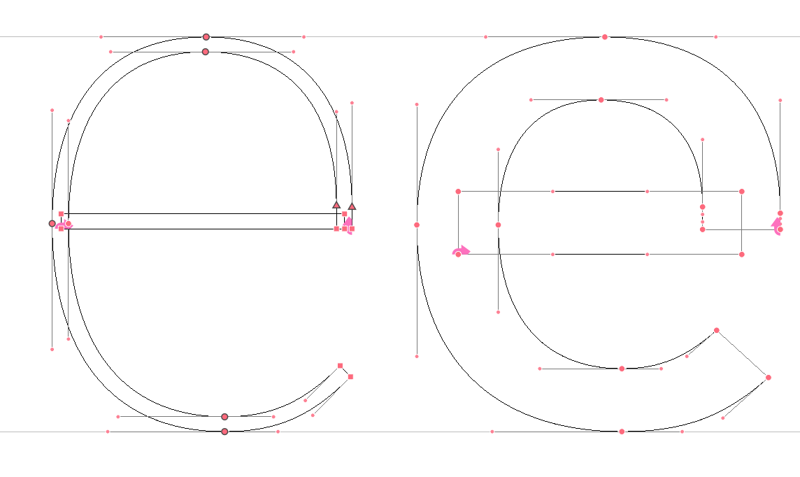
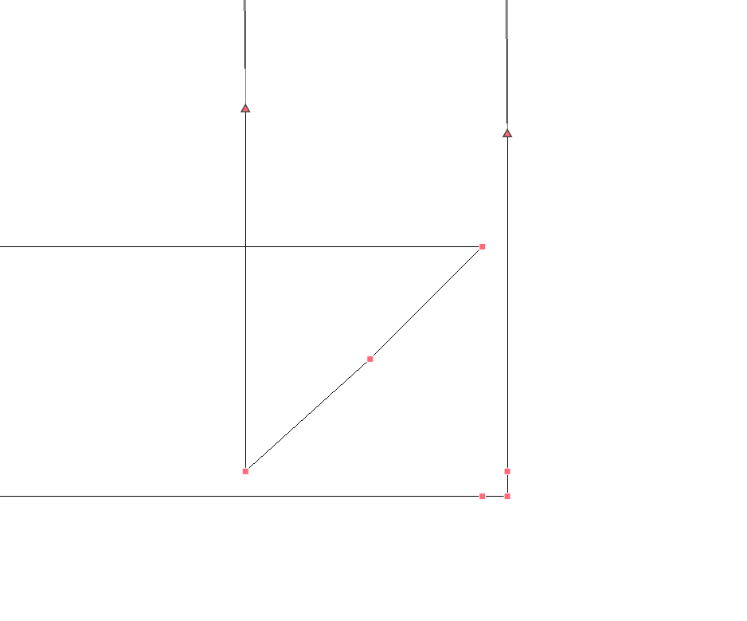
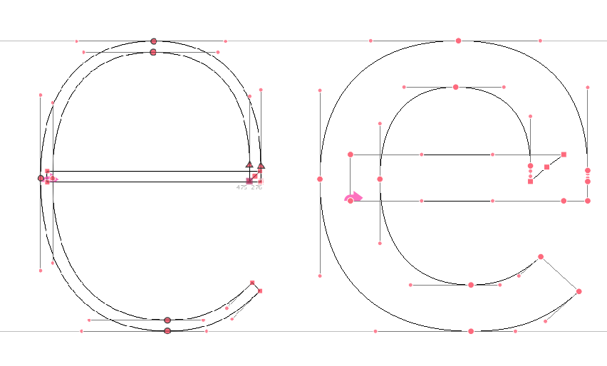

## Joints vs knots

One characteristic of a pen-stroke is its expansion  parallel to its skeleton line. This means a stroke always grows from the center to left and right. In some cases we can recalculate and compensate the joints or we can pin them to another location. The problem with pinning the center to somewhere else is the deformation of the skeleton itself. So far with RedPill, pining a left point to another left point is not so trivial as we can not use recursion and we cannot store coordinates. 

 

In this solution I follow the stroke as long as possible and use *knots* where we want to change direction.

I'm using a third point, or *corner point* as I need the `pointBefore` and `pointAfter` as references to shift `x` and `y` and they make sure the stroke starts (continues) at the same time and center. This is a close up of the base e knot:

 

And the original base with knot and bold with knot:

 
  
 
The code to achieve this is rather short (and I'm certain there's a even shorter cps solution):

	/* Corner Point */
	@namespace(glyph#e) {
	
	@dictionary {
	    right {
	        A: S"glyph#e penstroke:i(0) point:i(1) right":on:y;
	        B: S"glyph#e penstroke:i(0) point:i(3) right":on:x;
	    }
	}
	
	penstroke:i(0) point:i(2) > right {
	    on: Vector B A;
	    in: pointBefore:on;
	    out: pointAfter:on;
	    }
	penstroke:i(0) point:i(1) > right {
	    out: pointAfter:on;
	    }
	penstroke:i(0) point:i(3) > right {
	    in: pointBefore:on;
	    }    
	}
	
By repositioning the `in` and `out` points I simply clean up the redundant control points.