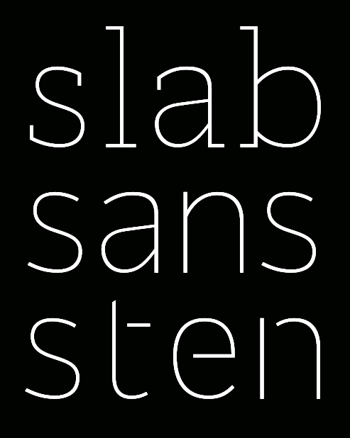

## Rendering the Super Family

#####Character Status
563 of the 721 characters are drawn and waiting to be processed with Metapolator/RedPill. The missing 158 glyphs are mainly math symbols and devanagari ligatures as the uni093F series. So we will start generating the super family and complete the set once sucsessfully tested.

The main branches of the family are `Sans`, `Slab Serif` and `Stencil`

All `.cps` files has been updated and includes now the `@import` method.

#####First batch

A first batch of the complete family can be reviewed. The glyph range has been limited to 90 characters due processing time. 

[Slab Serif](http://metapolator.github.io/slab/)
[Sans Serif](http://metapolator.github.io/sans/)
[Stencil](http://metapolator.github.io/sten/)

##### Issues

Known issues:

- no spacing yet. L and Right side bearings set equally.
- adjusting stroke angle on start and endings according to width.
- remove spikes on K, k etc.
- diagonal black compensation in A, W, M, w, etc.
- change small loops into closed knots in deva glyphs

Black: 
	
- increasing penwidth on capitals, make them darker. 
- too dark on some glyphs, stroke overlaps.

Compressed:
 
- could be more "compressed" 