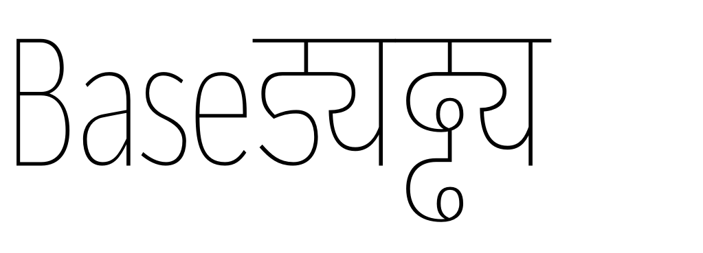
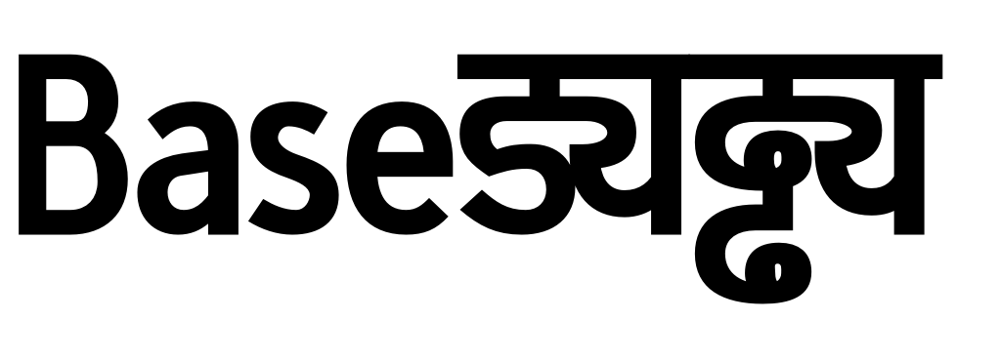
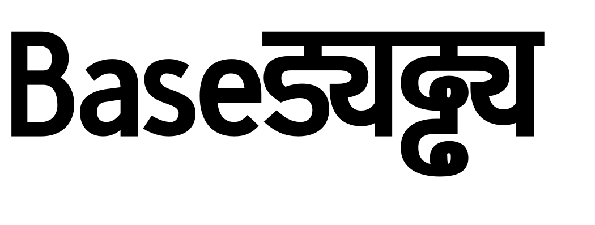
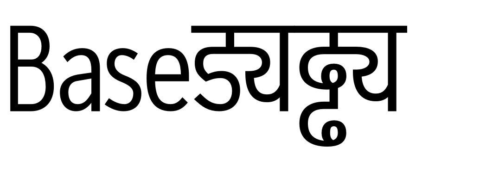
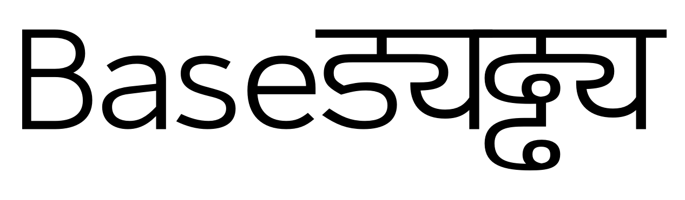

## Setting up *Thin Compressed* and *Black Compressed*

This is as straight forward as *Thin Wide*. I set `widthFactor` to `0.65`:

`a` and `s` looks a bit rough, I'll fix them later. First I want to check *Black Compressed*

I fix `B` and `uni0921094D092F` in the base.ufo and reload the base:

	metapolator import ../base.ufo base
	metapolator export blackcompressed blackcompressed.ufo

Also, I set `extraTension` to `1.1` to get less tension in the inner shapes like `s` and `uni0921094D092F`.

Ok, this should do for a rough version, lets check 50% interpolation of *Thin Compressed* and *Black Compressed* so I change interpolation.cps to:

	@dictionary {
	    * {
	        baseMaster1: S"master#thincompressed";
	        baseMaster2: S"master#blackcompressed";
	        proportion1: 50;
	        proportion2: 50;
	    }
	}
	

And I'm curious how 50% interpolation of *Thin Wide* and *Black Compressed* looks like:

So I guess its time for a family overview...

[back home](https://github.com/metapolator/sean)
