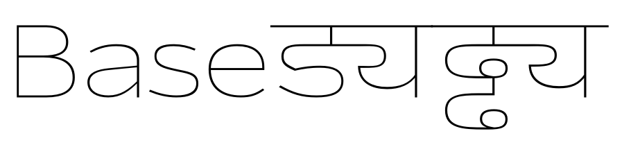

## Setting up *Thin Wide* in cps

Setting up *Thin Wide* should be rather straight forward as the base is already *Thin*. 
Lets start with duplicating *blackwide.cps* into *thinwide.cps* and add it to *project.yaml*. I set `weightFactor` back to `1` and `extraTension` to `1.1` on inner shapes, like in `s` or `uni0921094D092F`. We have to deal with extra long curves and they tend to *swing* back.

[back home](https://github.com/metapolator/sean)
